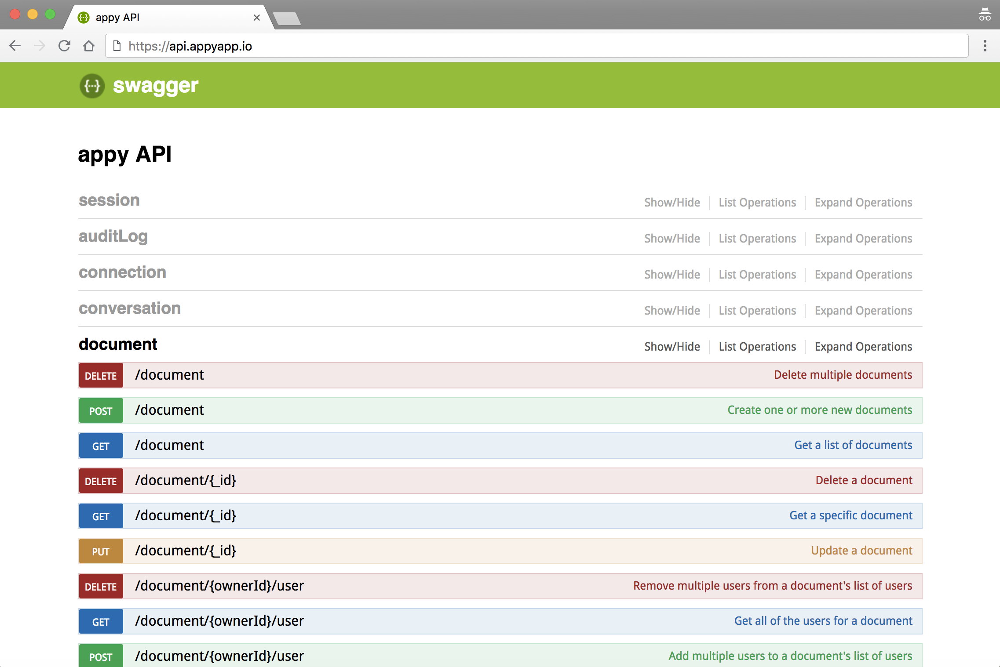

Swagger documentation (via [hapi-swagger](https://github.com/glennjones/hapi-swagger))is automatically generated for all endpoints and can be viewed by pointing a browser at the server URL. If you use the [getting started script](getting-started.md#using-the-plugin) this will be [http://localhost:8080/](http://localhost:8080/). The swagger docs provide quick access to testing your endpoints along with model schema descriptions and query options.

Below is an example screenshot from [api.appyapp.io](https://api.appyapp.io):

